[Go to Map List of the Game](https://github.com/Ranajoy01/Map_List_Path_to_silicon_RISC_V_SoC_Tapeout_game)

---

[Go to Level List of the Map-7](https://github.com/Ranajoy01/Map_7_Path_to_silicon_RISC_V_SoC_Tapeout_game)

<div align="center">:star::star::star::star::star::star:</div> 

# Level-1: Inception of open source EDA,OpenLANE and SKY130 PDK


## List of Objectives

- :microscope: <b>Practical Objective-1:</b> []()
  
 <div align="center">:star::star::star::star::star::star:</div> 

## :book:  1 : : SoC packaging and basic terms related to physical SoC chip
### :zap: 1.1  : : Big Picture
:rocket: Let's start with a development board (e.g.- Arduino, RasberryPi, Vsdsquadron etc) as the bigger picture for SoC application.

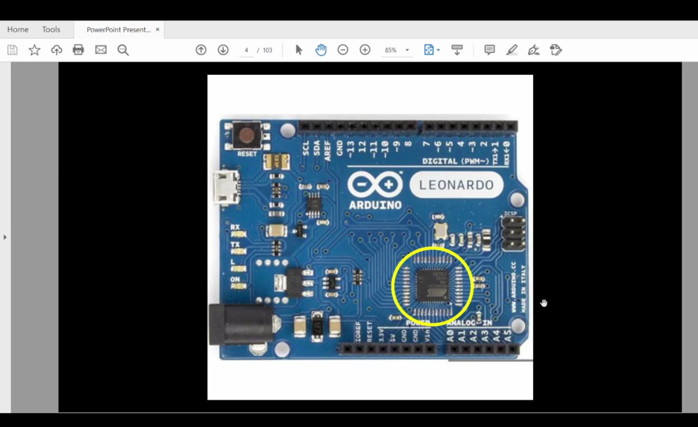

- Here we can observe the SoC is highlighted in the board. It performs all computing task.
- Other components and blocks are also present for interfacing.
- We consider it as chip, but this is the packaging and chip (semiconductor die) is inside it.
- The block diagram of the development board is shown below and we can observe that the SoC or processor is central block of the board.

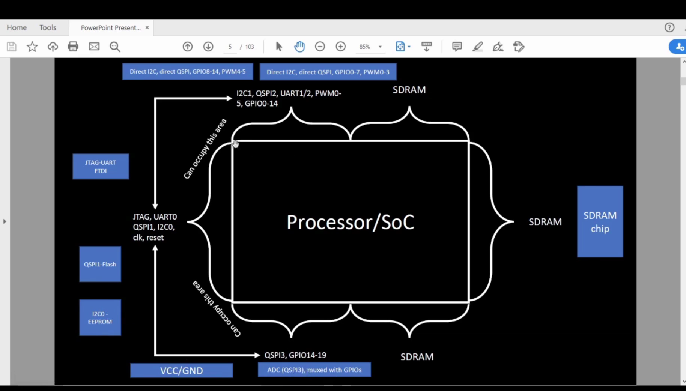

---

### :zap: 1.2 : : Packaging
:rocket: Packaging means shielding the chip from external things and give proper and reliavle interfacing.


- It is a `QFN 48` package. QFN signifies Quad flat no leads.
- The chip is inside it. And the package leads are connected to the chip pins with `wire bound`. This is shown below.
   


---

### :zap: 1.3 : : Basic terms related to Physical SoC chip 


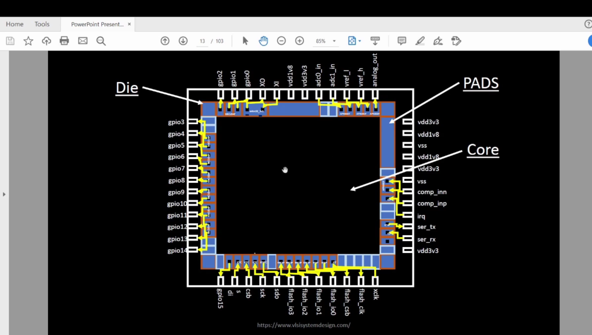

#### Die 
- Die is the total silicon wafer block for designing chip.
#### Core
- Core is the region or block defined in the die for logic circuit implementation.
- IPs, Macros,Cells are placed in this region.
#### Pads
- Pads are the interface between core (internal circuit) and package leads (external circuit) which manages data communication.
- These regions are defined in die.

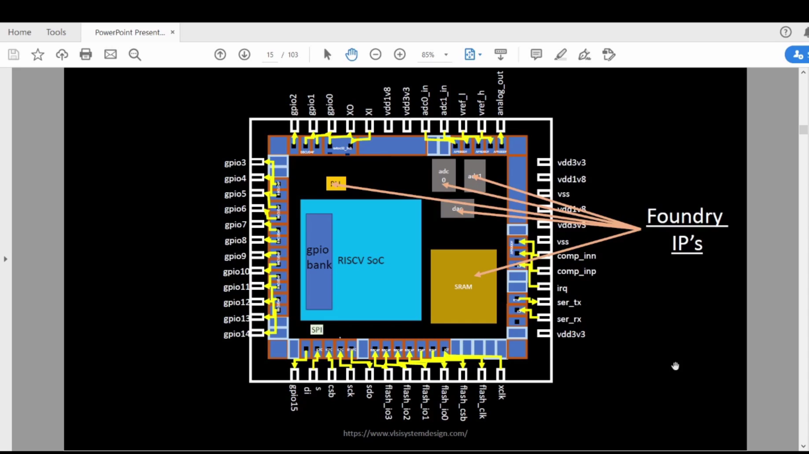

#### Foundry IPs
- Foundry IP signifies Foundry (Manufacturing unit) provided Intellectual property.
- Any logic circuit (digital/analog/mixed) block that is pre-designed, verified reusable block.
- Analog IPs (DAC, PLL, ADC).

#### Macros
- Any logic circuit (digital/analog/mixed) block that is pre-designed, verified, post-layout block.
- Having specific functionality.
- Macros (RISC-V SoC, SPI).

 <div align="center">:star::star::star::star::star::star:</div> 

## :book: 2 : : Hardware and software interfacing and ISA (RISC-V)
### :zap: 2.1 : : Introduction to ISA 
- ISA signifies instruction set architechture.
- It is the interface between hardware and software.
- `RISC-V` ISA is the open source ISA.

---

### :zap: 2.2 : : Software applications to hardware


- In the above image we can see the communication interface between application software and hardware through system software.
- Computers only understand binary format data.
- This binary data goes to SoC core layout and perform specific task based on transistors on / off.
- ISA specifies which combination of binary bits for which operation.
- Suppose `add r1 r1 r2' is an instruction in assembly language after compilation.
- Assembler (based on ISA) is converted to binary bits combinbination and passed to hardware (chip layout).
- ISA is abstract interface between application software and hardware.
- HDL (Verilog) helps to define ISA to hardware in RTL level.


- In the above figure a stopwatch application software is written in C language (any high level programming language).
- Then this C program is converted to assembly language using compiler.
- Then the assembler convert this to machine language.
- Machine language is passed to hardware layout and the stopwatch operation is performed.

 <div align="center">:star::star::star::star::star::star:</div> 
 
## :book: 3 : : Overview of the Opensource SoC design flow using OpenLANE
### :zap: 3.1 : : Opensource ASIC design flow
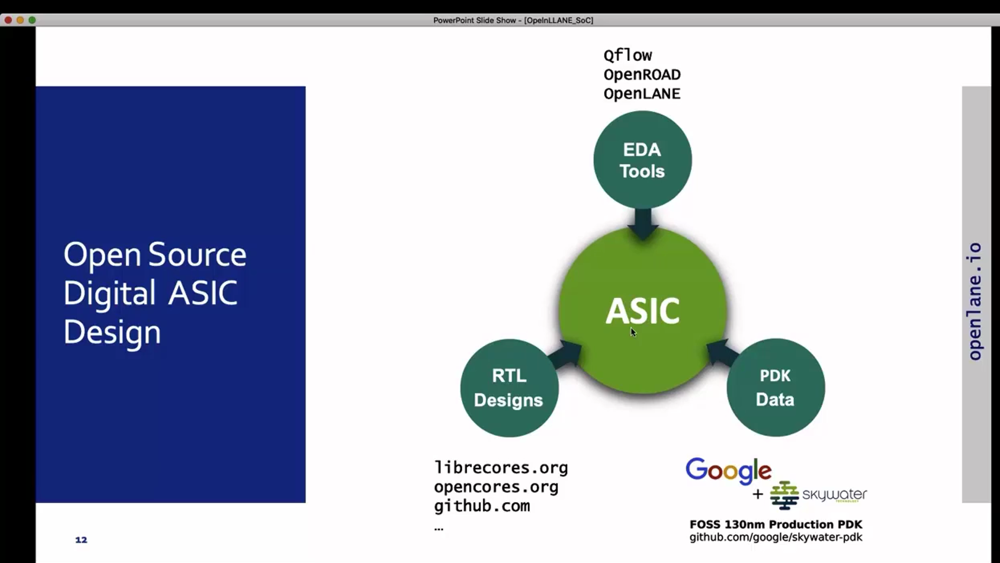

#### RTL designs
- These are the behavioral logic definition.
- These are generally weitten in HDL(Verilog).
- We can get opensource system/IP designs from the sources specified in the image. 

#### EDA tools
- These tools are required to analyze the RTL design and convert to GDSII.
- Some opensource EDA tools are yosys, OpenSTA, OpenROAD, Magic.

#### PDK
- In the early stage, `IC design` was integrated to manufacturing unit.
- To separate the `design` from `technology` PDK concept is invoked.
- PDK signifies Process design kit provided by foundry.
- PDK is collection of files
  - Device models
  - Process design rules
  - Standard cell libraries (timing, load etc)
- SKY130 PDK is a very popular opensource PDK for academic and research purpose.
  - 130 nm is the feature size for physical design.
  - It is old but supports enough fast design (around 1 GHz if properly designed) for research purpose.

---

### :zap: 3.2 : : RTL to GDSII flow
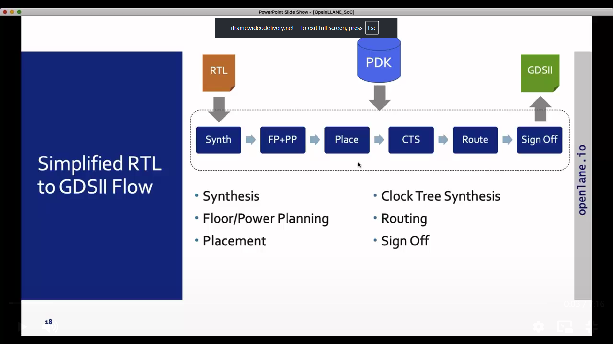

#### Synthesis
- Map standard cells from SCL for RTL design components and generate netlist.
- SCL is the standard cell library provided by pdk.
- Opensource tool: Yosys.
#### Floorplan and Power planning
- Create die and core as per cell requirement (netlist).
- Place Macros.
- PDN(Power distribution network) is generated.
- I/O pins are placed.
- Opensource tool: OpenROAD and magic.
#### Place
- Standard cells are placed in core.
- Detailed placement and optimization.
- Opensource tool: OpenROAD and magic.
#### Clock Tree Synthesis
- Clock network (clock buffers are placed).
- Opensource tool: TritonCTS and magic.
#### Route
- Cells are connected to each other (routing) and optimization in routing.
- Metal layers for routing.
- Opensource tool: TritonROUTE and magic.
- SKY130 PDK uses 6 metal layers. 
  - Lowest layer as `Local interconnect` and made of TiN.
  - Other five layers are made of aluminium.


#### Signoff
- Physical verification (DRC, LVS).
- Timing verification (STA).
- Opensource tool: OpenSTA, magic.

---

### :zap: 3.3 : : OpenLANE ASIC design flow
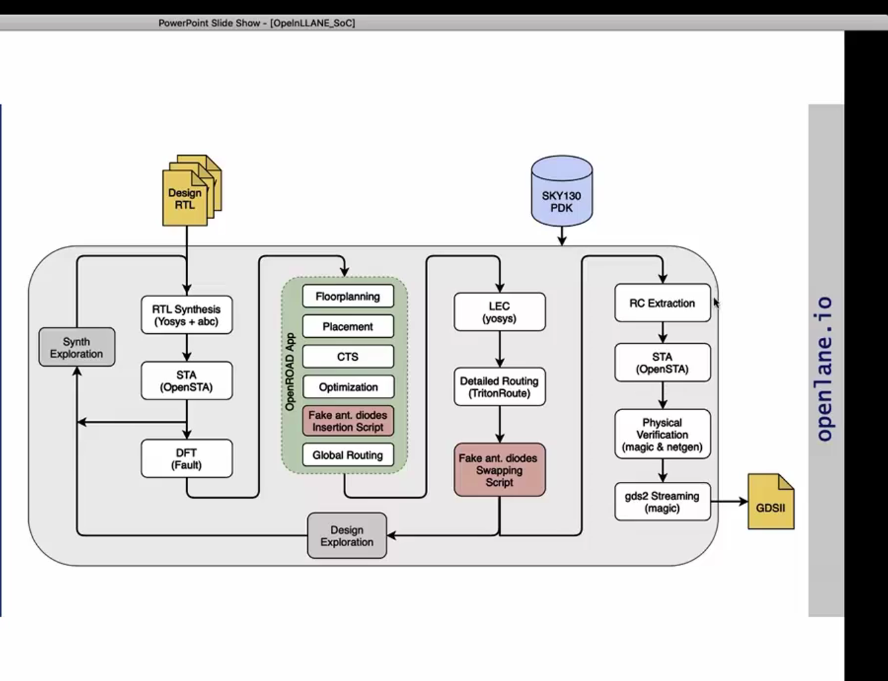

- Problems with opensource EDA tools was-
  - Tool qualification
  - Tool callibration
  - Missing tools
- To avoid this `OpenLANE`, a open source flow integrating different open source tools for tapeout experiment is designed.
- `striVe chipsets` are designed using the OpenLANE flow.

#### OpenLANE flow Characteristics
- Produce clean GDSII with no human in the loop.
- Clean means
 - LVS clean
 - DRC clean
 - Timing clean !! (Work in progress)

- Tuned for SKY130 PDK
- Two modes of operation
  - Autonomous
  - Interactive
- Design space exploration to find best set of flow
- Large number of design examples
#### Logic euivalence check (LEC)
- If netlist modified then verification is very important to check the required logic / function.
- PostCTS, PostRouting it is very important.
#### Fake antenna diodes insertion and swapping
- Why antenna rule violation occurs?
  
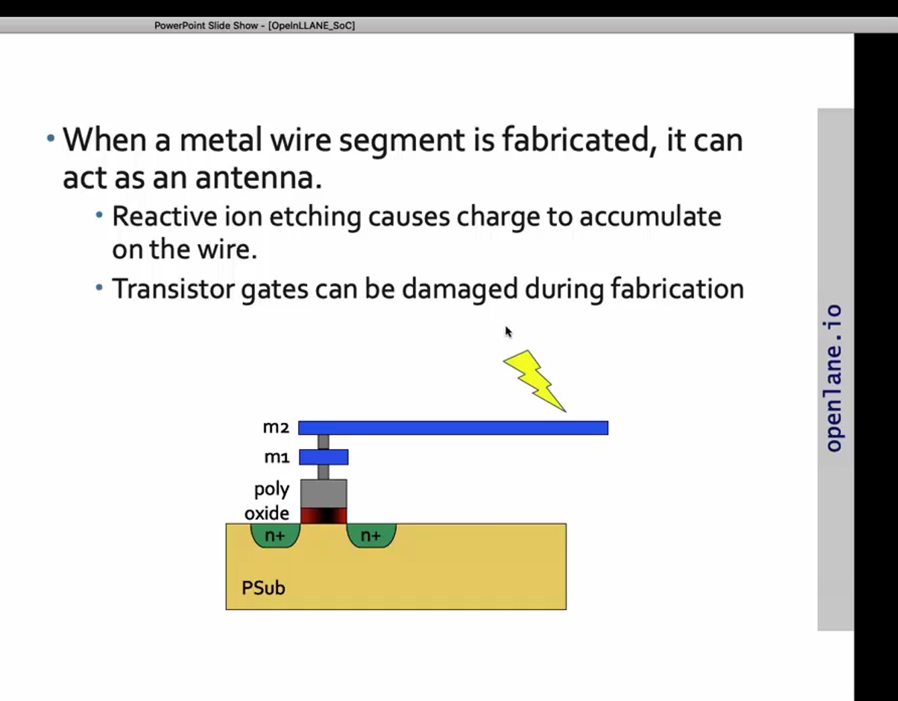

- Solution to Antenna rule violation.
  
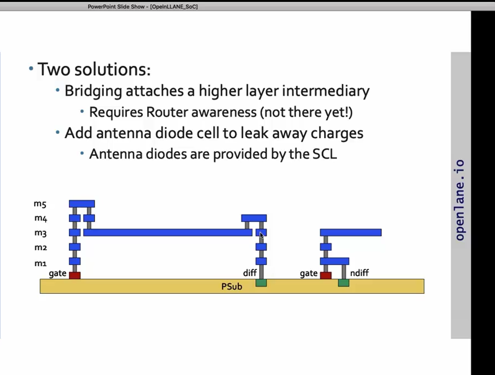

- Why fake cell insertion and swapping is important?
  
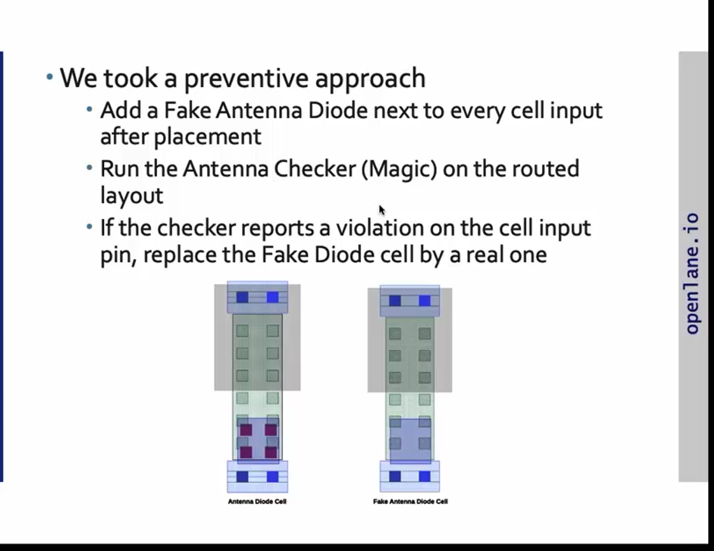

 
 <div align="center">:star::star::star::star::star::star:</div> 

## :microscope: 4 : : Explore work directory for openlane
### :zap: 4.1 : : Go inside the work directory and check PDKs
```bash
$ cd ~/Desktop/work/tools/openlane_working_dir & ls -ltr
$ cd pdks & ls -ltr
```
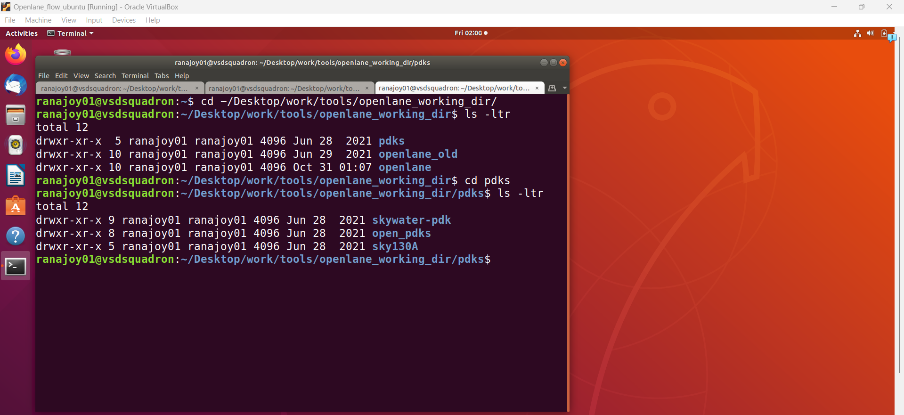

- Here in the `openlane_working_dir` directory there are three subdirectories-
  - `openlane` is the directory where we will invoke openlane flow.
- Here we can observe there are three subdirectories inside `pdks` directory
  - `skywater-pdk` is provided by foundry and it is not work on opensource tools.
  - `open_pdks` convert `skywater-pdk` files for using in opensource tools.
  - converted files are in `sky130A` directory.

 <div align="center">:star::star::star::star::star::star:</div> 

## :microscope: 5 : : Invoke openlane flow
### :zap: 5.1 : : As I have changed the username `vsduser` to `ranajoy01` for Ubuntu VM so change $PDK_ROOT (Do this for one time only)
- Open ~/bash.rc file and change `vsduser` to `$USER` (takes the current username) in $PDK_ROOT
```bash
# open
$ gvim ~/.bashrc
```
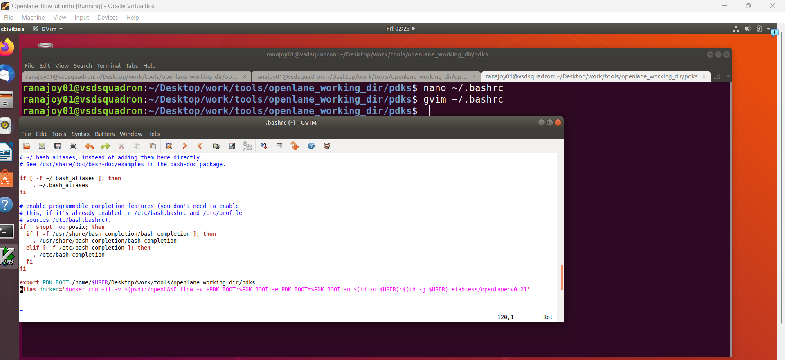

- Here we can see that alias `docker` is defined for "docker run -it -v $(pwd):/openLANE_flow -v $PDK_ROOT:$PDK_ROOT -e PDK_ROOT=$PDK_ROOT -u $(id -u $USER):$(id -g $USER) efabless/openlane:v0.21"
 - Openlane uses many open source tools. If we download all separately then the enviornment will become unstable due to version issues.
 - To avoid unstability docker is used . It produce another shell inside VM.
 - Docker contains all the tools for Openlane.
 - Here `efabless/openlane:v0.21` docker image is used.

### :zap: 5.2 : : Start openlane flow
#### Step-1:Go to `openlane` directory-
```bash
$ cd ~/Desktop/work/tools/openlane_working_dir/openlane/
```
#### Step-2:Start docker shell-
```bash
$ docker
```
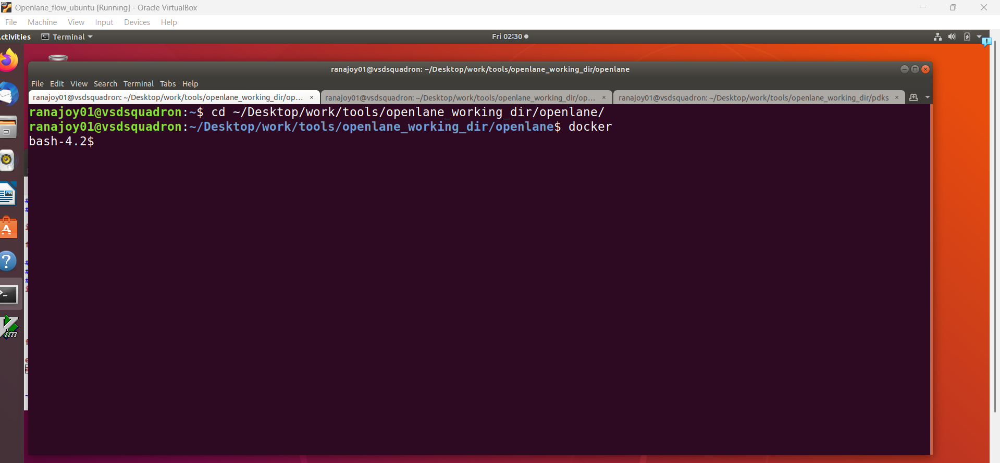
#### Step-3:Start interactive flow-
```bash
$ ./flow.tcl -interactive
```

#### Step-4:Package specify-
```bash
$ package require openlane 0.9
```
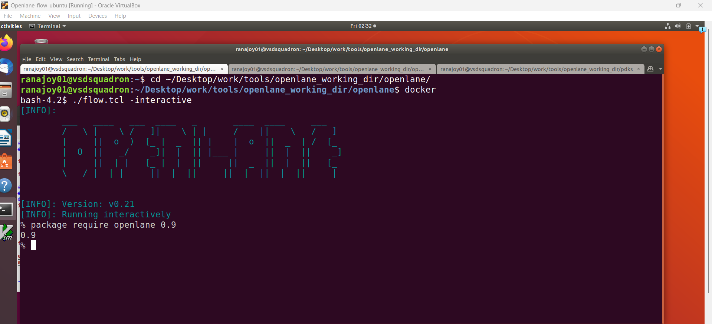

### :zap: 5.3 : :  Prepare design (example picorv32a)
```bash
$ prep -design picorv32a
```
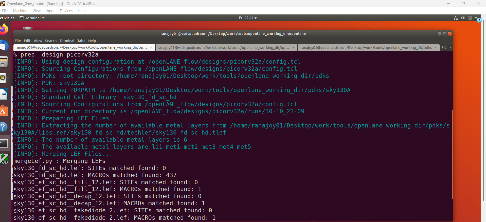

- This command also generate `run` directory in `~/Desktop/work/tools/openlane_working_dir/openlane/designs/picorv32a` directory.(If not present already)
- LEF (library exchange format) are merged.

 <div align="center">:star::star::star::star::star::star:</div> 

## :microscope: 6 : : Synthesize picorv32a using openlane flow and calculate flop ratio
### :zap: 6.1 : : After preparing the design we can run the synthesis-
```bash
$ run_synthesis
```
- It will perform logic optimization and cell mapping using Yosys and Abc.
- Timing analysis using opensta is also performed.
- The synthesized netlist result is stored in `~/Desktop/work/tools/openlane_working_dir/openlane/designs/picorv32a/runs/30-10_21-09/results/synthesis` in this directory as `picorv32a.synthesis.v`.
- The synthesis reports and post-synthesis timing analysis reports are stored in `~/Desktop/work/tools/openlane_working_dir/openlane/designs/picorv32a/runs/30-10_21-09/reports/synthesis` .

#### Start synthesis
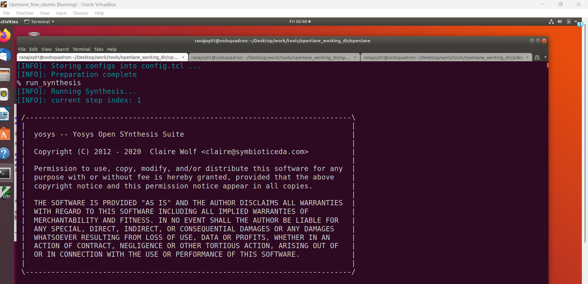
#### Finish synthesis
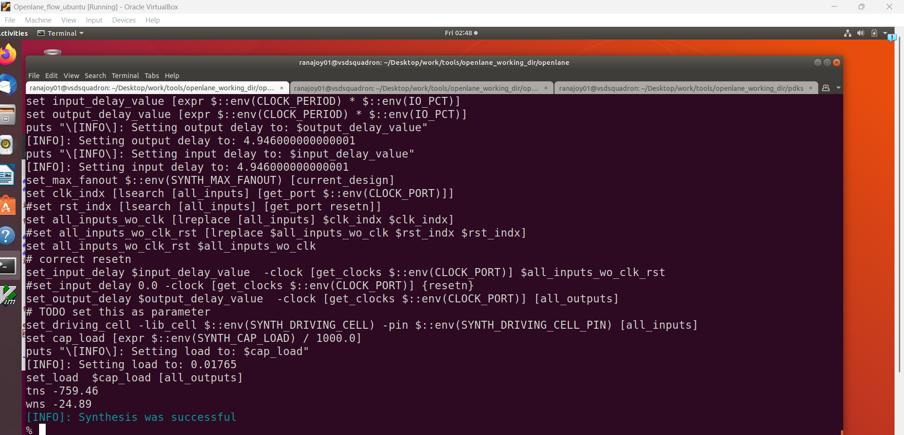

### :zap: 6.2 : : Analyze synthesis reports and calulate flop ratio-
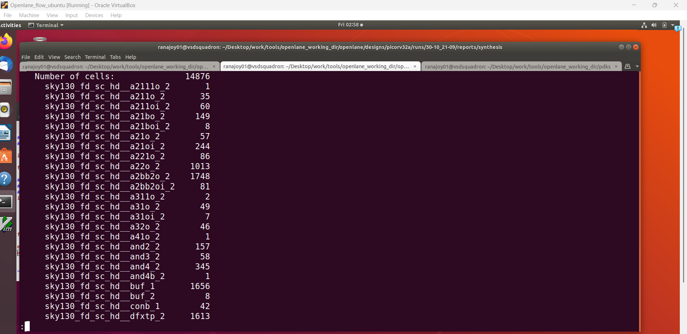

- Total no. of cells -> 14876
- No. of flop cells -> 1613

$$\text{Flop Ratio} = \frac{\text{No. of flop cells}}{\text{Total no. of cells}}$$ = 0.1084

- Higher flop ratio signifies digital system heavily relies on sequential logic.


 <div align="center">:star::star::star::star::star::star:</div> 
 

 ## :trophy: Level Status: 

- All objectives completed.
- I have learned hardware software interfacing, overview of openlane flow, synthesis, flop ratio.
- 🔓 Next level unlocked 🔜 [Level-2: Good Floorplan vs Bad Floorplan and introduction to library cells](../Level_2/readme.md).
  
<div align="center">:star::star::star::star::star::star:</div> 


