[Go to Map List of the Game](https://github.com/Ranajoy01/Map_List_Path_to_silicon_RISC_V_SoC_Tapeout_game)

---

[Go to Level List of the Map-7](https://github.com/Ranajoy01/Map_7_Path_to_silicon_RISC_V_SoC_Tapeout_game)

---

[Go to Previous Level](../Level_1/readme.md)

<div align="center">:star::star::star::star::star::star:</div> 

# Level-2: Good Floorplan vs Bad Floorplan and introduction to library cells


## List of Objectives

- :microscope: <b>Pracical Objective-1:</b> []()

  
<div align="center">:star::star::star::star::star::star:</div> 

## :microscope: 1 : : `picorv32a` chip floorplanning and related terms
### :zap: 1.1 : : Run floorplan using openlane flow
- In openlane flow after synthesizing the design, we can perform floorplan. Synthesis is done in the previous level. Now run floorplan using the following command in docker shell-
#### Command 
```bash
$ run_floorplan
```
#### Start Floorplan log
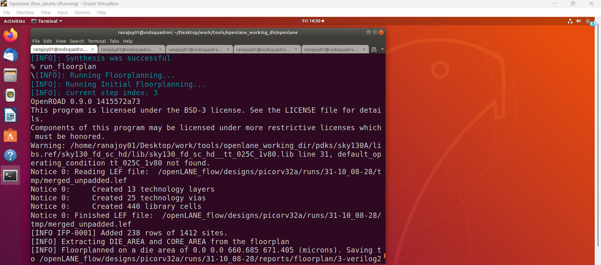
#### End Floorplan log
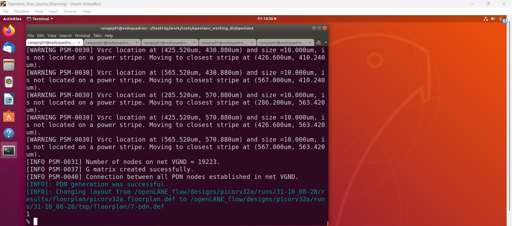

- Def file is generated `~/Desktop/work/tools/openlane_working_dir/openlane/designs/picorv32a/runs/31-10_08-28/results/floorplan/picorv32a.floorplan.def` 

---

### :zap: 1.2 : : Load the generated def (design exchange format) file in magic and visualize floorplan layout 
#### Command and log
```bash
$ magic -T ~/Desktop/work/tools/openlane_working_dir/pdks/sky130A/libs.tech/magic/sky130A.tech lef read ~/Desktop/work/tools/openlane_working_dir/openlane/designs/picorv32a/runs/31-10_08-28/tmp/merged.lef def read ~/Desktop/work/tools/openlane_working_dir/openlane/designs/picorv32a/runs/31-10_08-28/results/floorplan/picorv32a.floorplan.def &
```
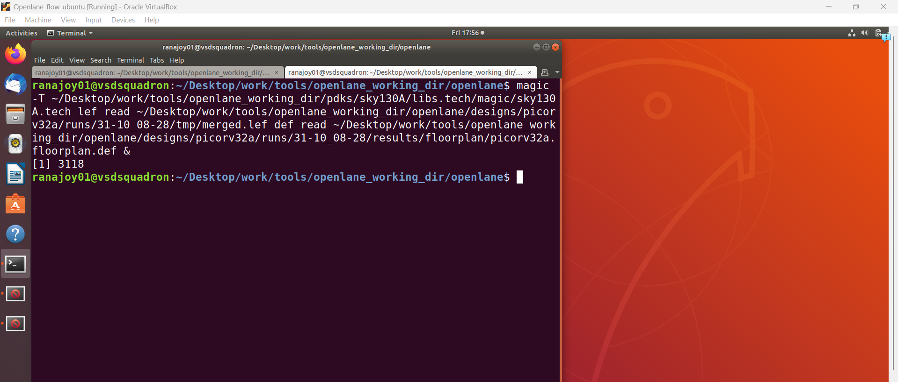

- tech file, lef file and def files are provided to magic
- & at the last specify that end prompt after opening layout in magic

#### Floorplan Layout
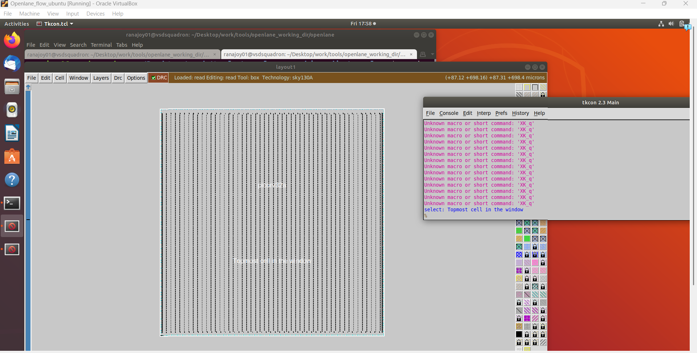

- picorv32a floorplan layout is visualized
- A command shell also opened

---

### :zap: 1.3 : : (Floorplan Operation-1) Define die and core area
#### Synthesized netlist to die and core definition
- Different cell size of same cell provide different speed.
- So as per logic and speed requirement the cells are selected.
- Total cell occupied area and utilization factor help in die size calculation. 

#### Utilization factor and aspect ratio 
- Priority order (highest first) of the configuration files are shown below
   -  ~/Desktop/work/tools/openlane_working_dir/openlane/designs/picorv32a/sky130A_sky130_fd_sc_hd_config.tcl
   -  ~/Desktop/work/tools/openlane_working_dir/openlane/designs/picorv32a/config.tcl
   -  ~/Desktop/work/tools/openlane_working_dir/openlane/configuration/floorplan.tcl

- In the file-3 we see that

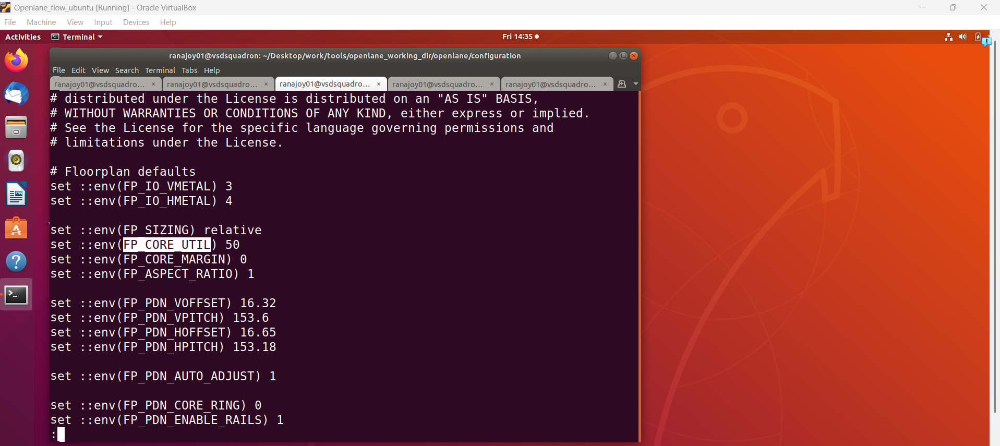
- In the file-1 we see that

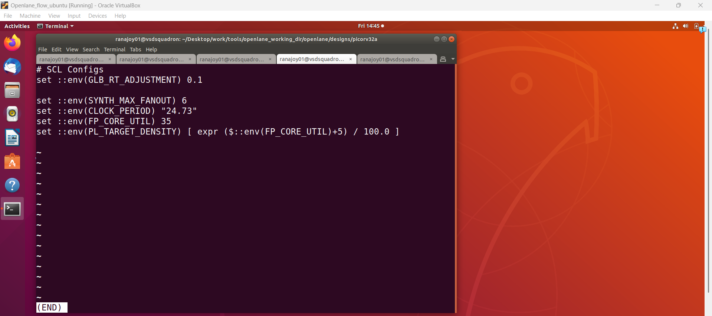

---

$$
\text{Utilization Factor} = \frac{\text{Area of all netlist cells}}{\text{Area of core}}
$$

---

- Utilization = 50 %
- Aspect ratio =1 (Width and height same, square shape)
- Vertical metal layer fo I/O = 3 (actually one more than the specified value)
- Horizontal metal layer for I/O =4 (actually one more than the specified value)

 
- In the floorplan log we can see that-

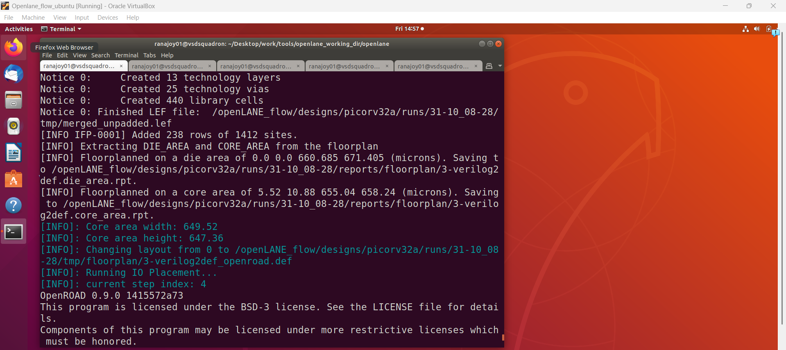

- Die height -> 671.405 micron
- Die width -> 660.685 micron
- Core height -> 647.36 micron
- Core width -> 649.52 micron
- Die area -> 4,43,587.212425 square micron
- Core are -> 4,20,473.2672 

---

### :zap: 1.4 : : (Floorplan Operation-2) Preplaced cells
#### Importance of preplace cell
- Reusable, layout ready blocks are preplaced during floorplan
- Macros, Special IPs are preplaced cells 
- These are like black box, block I/O s are present.

---

### :zap: 1.5 : : (Floorplan Operation-3) Decoupling capacitor
#### Importance of Decap
- If power supply is very far from the circuit then voltage fluctuation due to wire R and L.
- To avoid this fluctuation and unstability decoupling capacitor are placed between Vdd and Vgnd.
- Works as local chanrge and energy storage.

#### Decap cells in floorplan layout
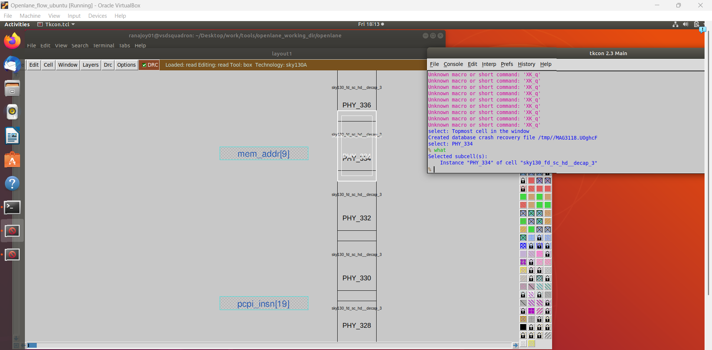

--- 
### :zap: 1.6 : : (Floorplan Operation-4) Power planning 
#### Importance of power planning
- Ground bounce and voltage droop is caused due to long power network
- Power rail grid is used for providing stable power to all cells
- Generally power distribution network is part of floorplan but in opeenlane flow it is performed after CTS.

---
### :zap: 1.7 : : (Floorplan Operation-5) Pin placement and logic cell placement blockage
#### Importance of pin placement and blockage
- Where to place I/O pins are defined by user near the edges of die
- Data pins are smaller than clk pins for providing fast clk (less resistance path)
- Logic cell placement blockage is the region where no logic cells can be placed (pins are placed there)
#### Pin placement in floorplan layout
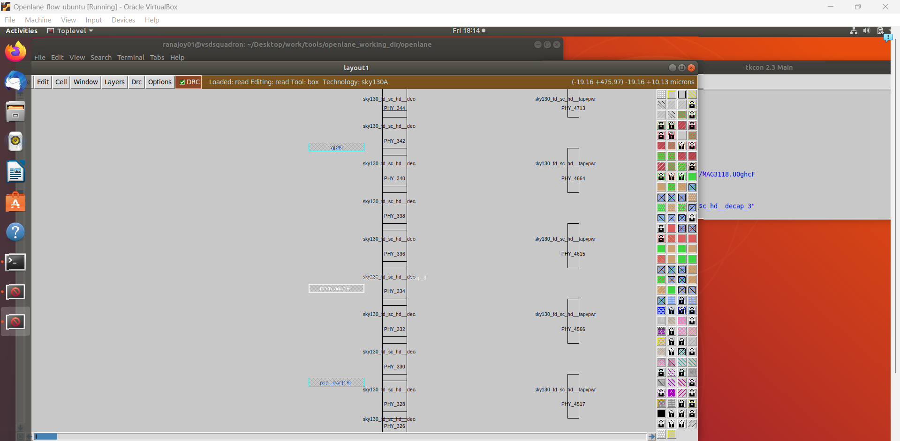

- Pins are placed in equal distance from eachother
- Vertical pins in metal layer 2
- 
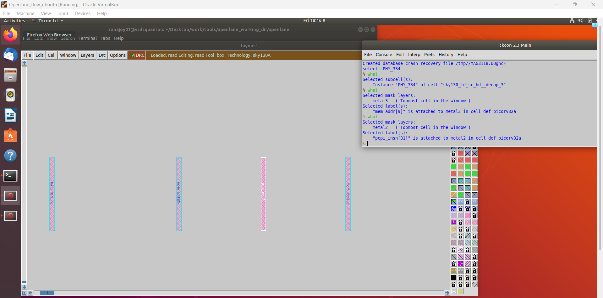
- Horizontal pins in metal layer 3
  
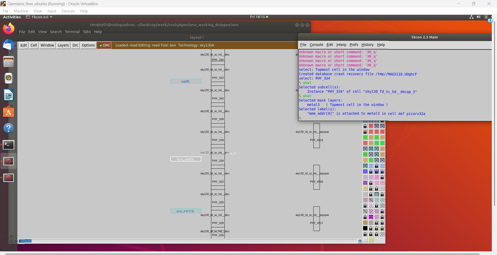

---
### :zap: 1.8 : : (Floorplan Operation-6) Tapcell placement
#### Importance of tapcell
- Connect n- well to Vdd and substrate to ground to avoid latch-up
- Surrounding tapcells are diagonally equidistant.
#### Tap cells in floorplan layout
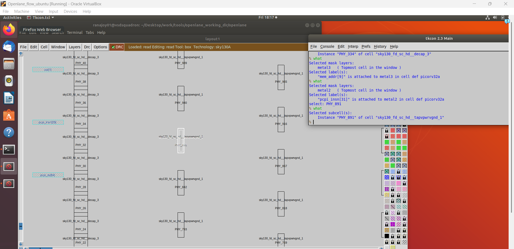


<div align="center">:star::star::star::star::star::star:</div> 

## :microscope: 2 : : Placement and importance of library characterization and modeling
### :zap: 2.1 : : Introduction to placement
#### Importance of placement
- Global placement
  - Map standard cell layout from library for the cells present in netlist
  - As per the distance from I/O pins or nets cells are roughly placed over the core
  - Cells may overlap with eachother
- Detailed placement
  - Legalize the cell location 
  - In specific row and site cells are placed
  - No overlap with eachother
  - Datapath buffers (as repeater) are added for longer distance between two cells
  - Optimization for wire distance is performed
  - HPWL (Half parameter wire length) is very important placement metric
  
### :zap: 2.2 : : Placement for picorv32a design
#### command and logs
```bash
$ run_placement
```
- If overflow reduces with the increase in iteration then the placemnt will be converged

##### Global placement log
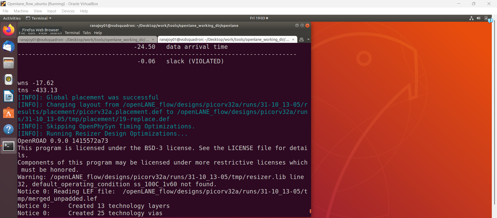
##### Detailed placement log
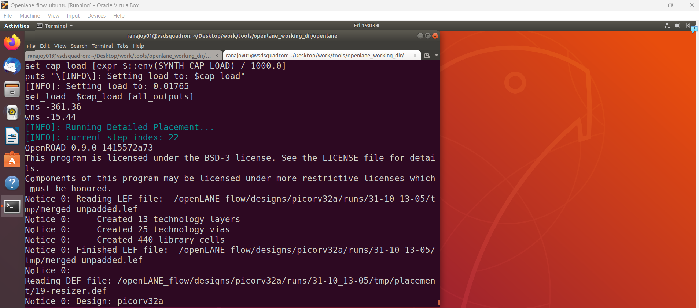

- Def file is generated `~/Desktop/work/tools/openlane_working_dir/openlane/designs/picorv32a/runs/31-10_13-05/results/placement/picorv32a.placement.def` 

---

### :zap: 2.3 : : Load the generated def (design exchange format) file in magic and visualize placement layout 
#### Command and log
```bash
$ magic -T ~/Desktop/work/tools/openlane_working_dir/pdks/sky130A/libs.tech/magic/sky130A.tech lef read ~/Desktop/work/tools/openlane_working_dir/openlane/designs/picorv32a/runs/31-10_13-05/tmp/merged.lef def read ~/Desktop/work/tools/openlane_working_dir/openlane/designs/picorv32a/runs/31-10_13-05/results/placement/picorv32a.placement.def &
```
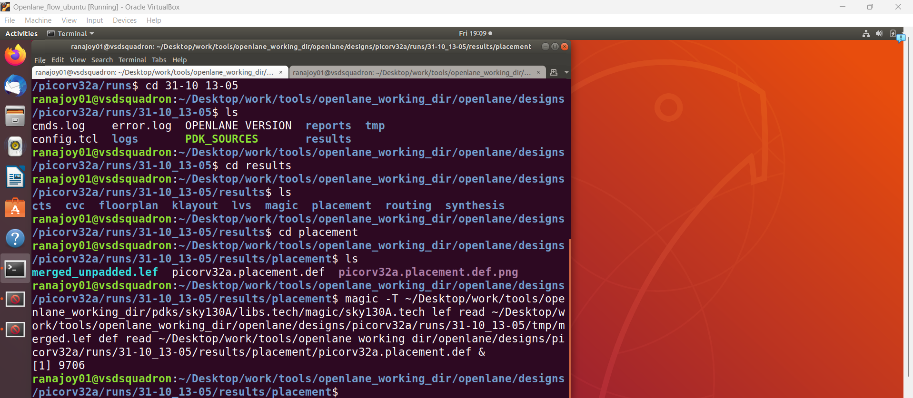

- tech file, lef file and def files are provided to magic
- & at the last specify that end prompt after opening layout in magic

#### Placement Layout
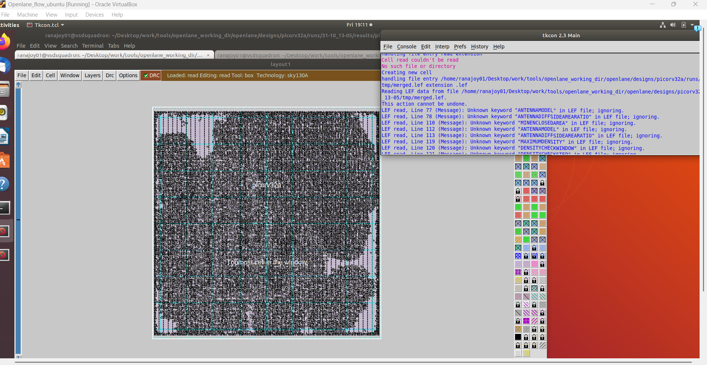

- picorv32a placement layout is visualized
- A command shell also opened

##### Legal standard cell placemnt in layout
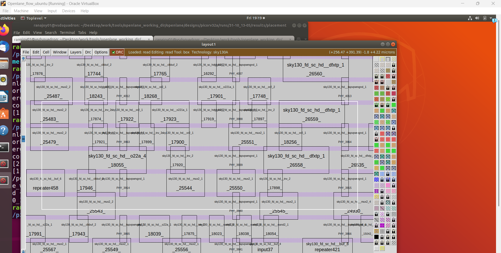
##### Datapath repeater placement
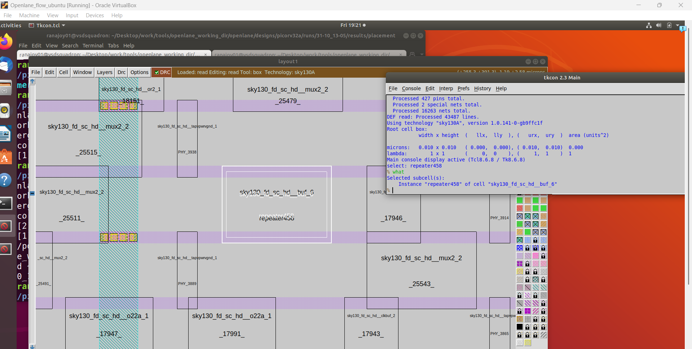

### :zap: 2.4 : : Importance of library characterization and modeling
#### What is the common thing required in ASIC design flow?
- Gates or cells
#### Why characterization and modeling of library
- Library is the collection of cell
 - Different type of cell
 - Same cell with different size for different speed
 - Timing characterization
- We can interpret cells using notations but the EDA tools require specific cell model and characterization style to interpret. 

<div align="center">:star::star::star::star::star::star:</div> 

## :book: 3 : : Cell design flow
### :zap: 3.1 : : (Step -1) Input
- PDKs (lambda based design)
- DRC and LVS rules
- Library and user defined specification
  - Cell height (Based on row distance and power rail)
  - Pin layer
  - Supply voltage
- Spice models (Id, Vth)  
### :zap: 3.2 : : (Step -2) Design
- Circuit design (O/P : CDL)
- Layout design (O/P : GDSII, LEF , parasitics in spice)
  - Euler's path
  - Stick diagram
  - Take widths based on switching threshold requirement
   
### :zap: 3.3 : : (Step -3) Characterization
:rocket: GUNA software is used for characterization.
- Timing characterization
  - Timing threshold
  - Propagation delay
  - Transistion time
- Power characterization
- Noise characterization

<div align="center">:star::star::star::star::star::star:</div> 


## :trophy: Level Status: 

- All objectives completed.
- I have learned about timing paths ,timing graph, setup and hold analysis, slack, critical path, interpretetion of timing report ,variation in real case.
- 🔓 Next level unlocked 🔜 [Level-3: Design Library cell using Magic Layout and ngspice characterization](../Level_3/readme.md).
  
<div align="center">:star::star::star::star::star::star:</div> 


