[Go to Map List of the Game](https://github.com/Ranajoy01/Map_List_Path_to_silicon_RISC_V_SoC_Tapeout_game)

---

[Go to Level List of the Map-7](https://github.com/Ranajoy01/Map_7_Path_to_silicon_RISC_V_SoC_Tapeout_game)

---

[Go to Previous Level](../Level_2/readme.md)

<div align="center">:star::star::star::star::star::star:</div> 

# Level-3: Design Library cell using Magic Layout and ngspice characterization
  
<div align="center">:star::star::star::star::star::star:</div> 

## :zap: Clone custom CMOS inverter cell design and open Cell Layout
### 1) Clone inverter cell design in openlane directory-
```bash
$ git clone https://github.com/nickson-jose/vsdstdcelldesign.git
```
### 2) Open cell layout-
```bash
magic -T ./libs/sky130A.tech sky130_inv.mag &
```
### 3) Command logs-
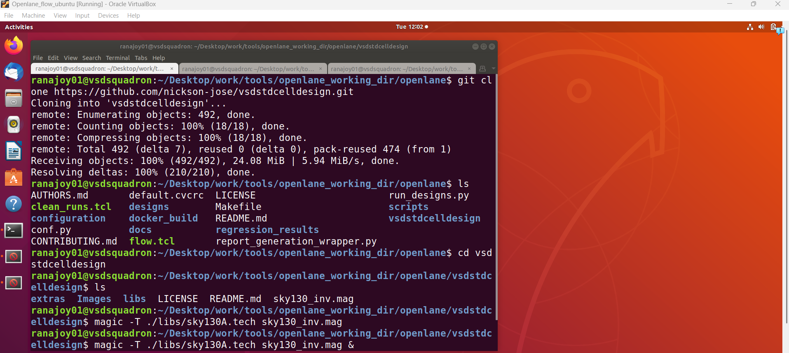
### 4) Layout result-
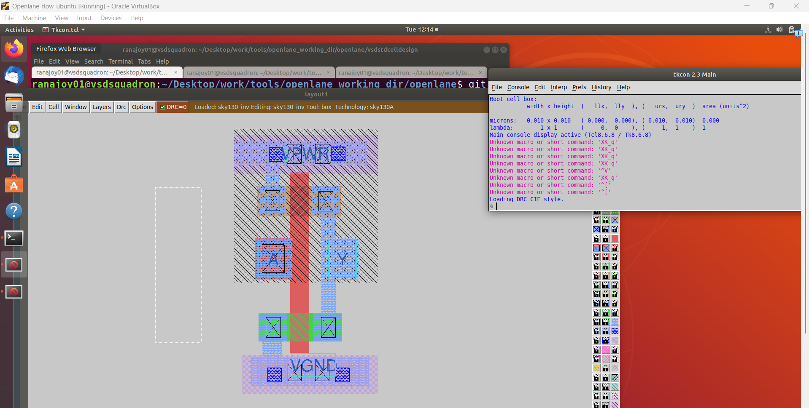

### 5) CMOS inverter structure verification-
#### 5.1) NMOS check-
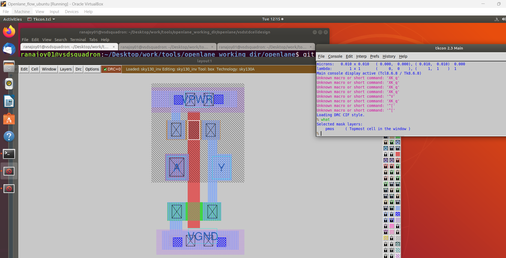
#### 5.2) PMOS check-
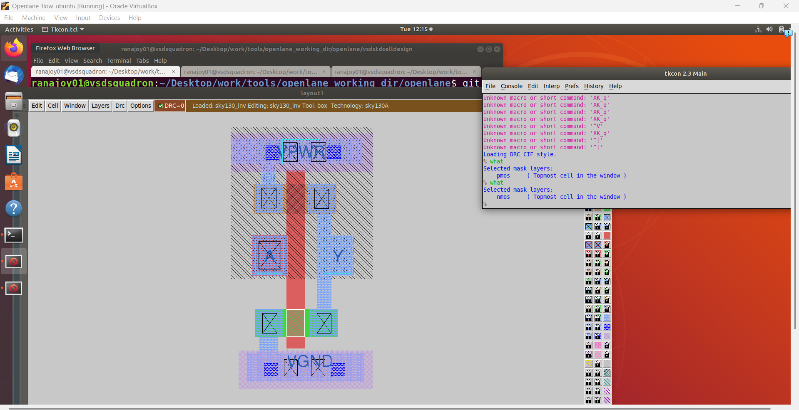
#### 5.3) NMOS drain and PMOS drain connectivity check-
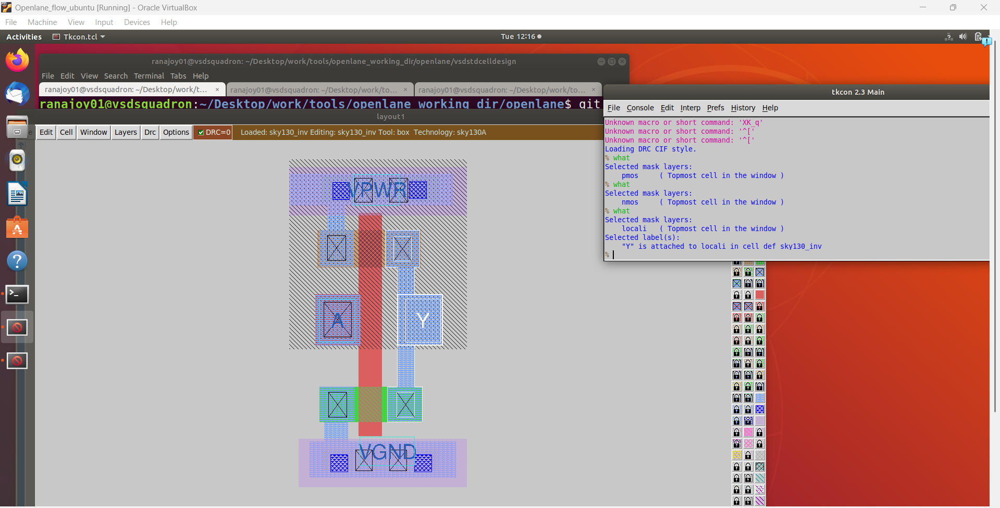
#### 5.4) NMOS source to Vgnd check-
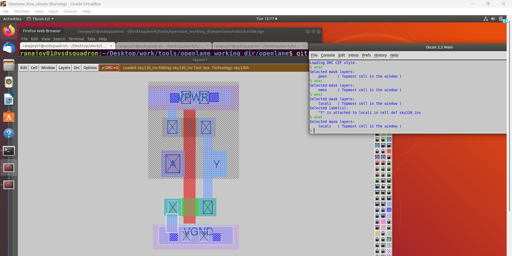
#### 5.5) PMOS source to Vpwr check-
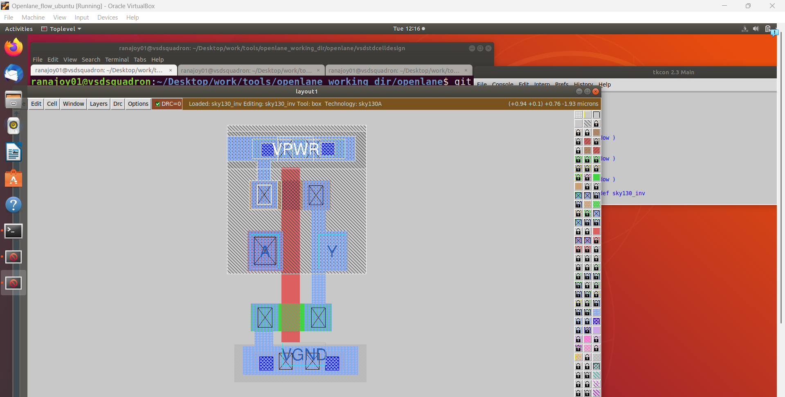

<div align="center">:star::star::star::star::star::star:</div> 

## :zap: CMOS inverter layout design process reference and DRC check
### 1) Go through the [vsdstdcelldesign repository readme file](https://github.com/nickson-jose/vsdstdcelldesign) to understand the layout design process
- Generally 16 mask CMOS fabrication process is used.
- Importance of different layers
   - pwell
   - nwell
   - metal layers
   - local interconnect
   - contact (cross marked region)
   - diffusion region
### 2) DRC check
- Magic tool is very much dependent on design rule check
- Now delete a portion of layer to observe DRC error-
  
``` Select box using mouse and click the scroll wheel```

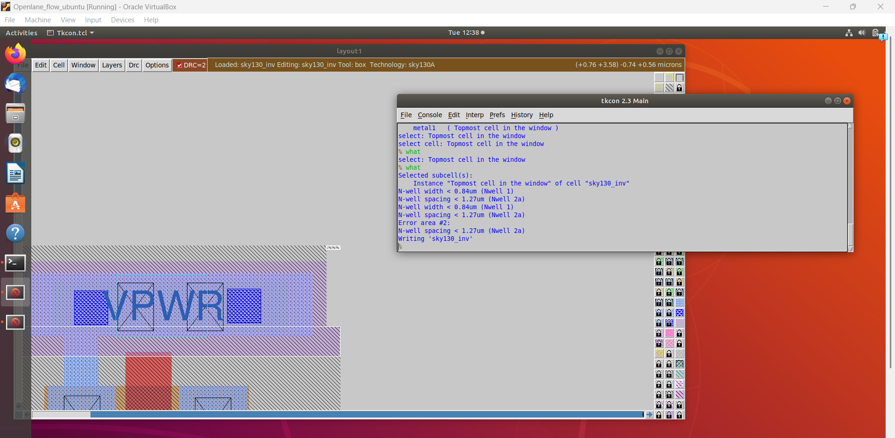
  
<div align="center">:star::star::star::star::star::star:</div> 

## :zap: Extract spice netlist for custom inverter-
### 1) Commands used
```bash
# Generate .ext file from layout
extract all
# Consider parasitics
ext2spice cthres 0 rthres 0
# Convert .ext to .spice
ext2spice
```
### 2) Command log
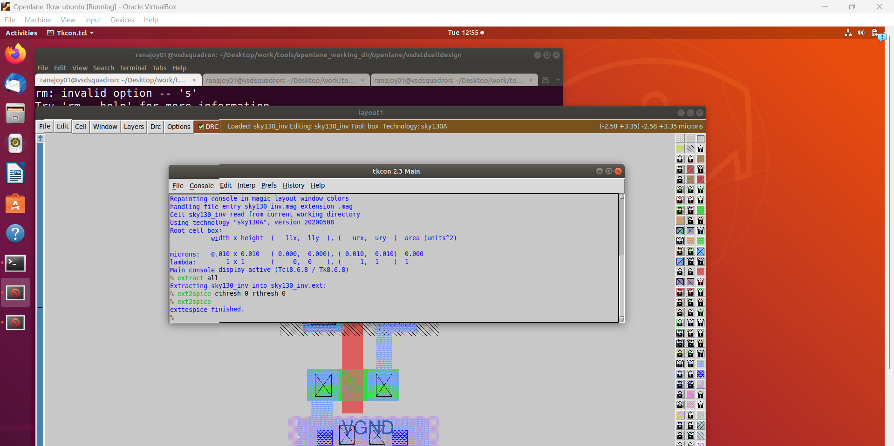
### 3) Generated netlist-
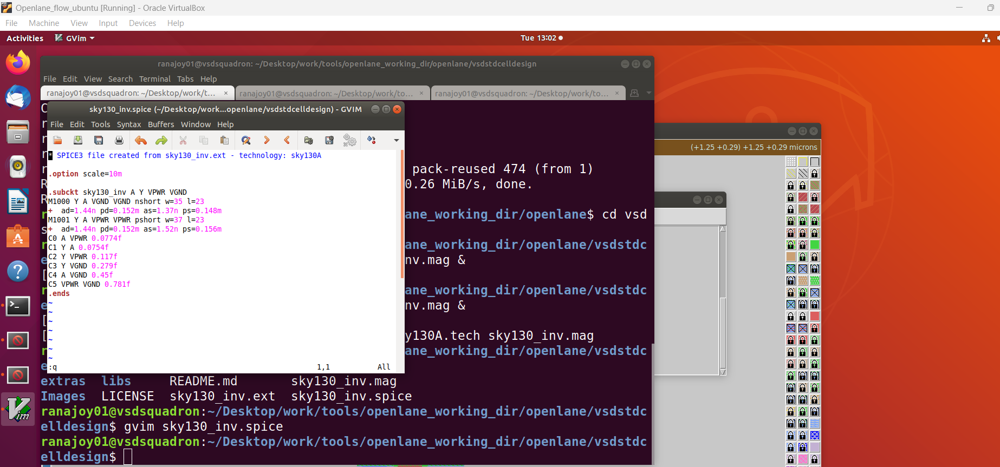

<div align="center">:star::star::star::star::star::star:</div> 

## :zap: CMOS inverter cell ngspice simulation and characterization
### 1) Modify the generated spice file to use it for characterization
Grid smallest box dimension= 0.010 micron

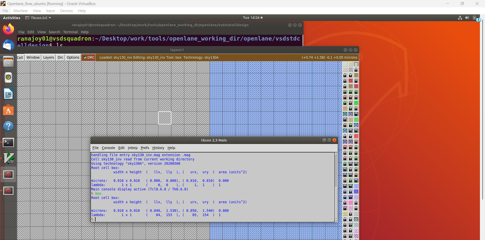

#### Edit netlist

```
* SPICE3 file created from sky130_inv.ext - technology: sky130A
///////// //M represent  next line is modified
// M
.option scale=0.010u
//M
.include ./libs/pshort.lib
//M
.include ./libs/nshort.lib

//M
//.subckt sky130_inv A Y VPWR VGND
//M
M1000 Y A VGND VGND nshort_model.0 w=35 l=23
+  ad=1.44n pd=0.152m as=1.37n ps=0.148m
//M
M1001 Y A VPWR VPWR pshort_model.0  w=37 l=23
+  ad=1.44n pd=0.152m as=1.52n ps=0.156m
//M
VDD VPWR 0 3.3v
//M
VSS VGND 0 0V
//M
Va A VGND PULSE(0 3.3v 0 0.1ns 0.1ns 2ns 4ns)
C0 A VPWR 0.0774f
C1 Y A 0.0754f
C2 Y VPWR 0.117f
C3 Y VGND 0.279f
C4 A VGND 0.45f
C5 VPWR VGND 0.781f
//M
//.ends
//M
.tran 1n 20n
//M
.control
run
.endc
.end
```
#### Ngspice simulation
```
ngspice sky130_inv.spice
plot y vs time a
```
#### Log
[cell_ptl](images/cell_ptl.png)
##### Plot
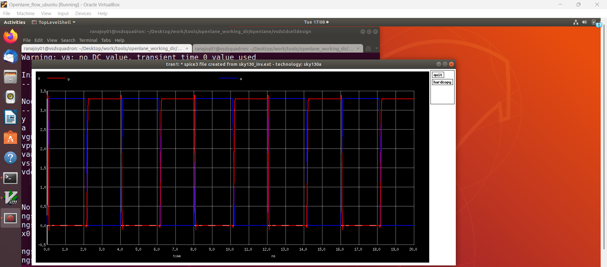
### 2) Timing characterizaation
#### Threshold characterization 

|Threshold name|Voltage level in percentage|Voltage level based on 3.3 V
|---|---|---|---|
|Slew Low Fall threshold|20%|0.66V
|Slew high Fall threshold|20%|0.66V
|Slew Low Rise threshold|80%|2.64V
|Slew high Rise threshold|80%|2.64V
|Rise threshold|50%|1.65V|0.05ns
|Fall threshold|50%|1.65V|0.05ns

*** The time at the threshold voltage level is required.

#### Rise time cell delay= output rise to 50 % - input fall to 50% = 6.1798ns - 6.150 ns= 0.0298ns
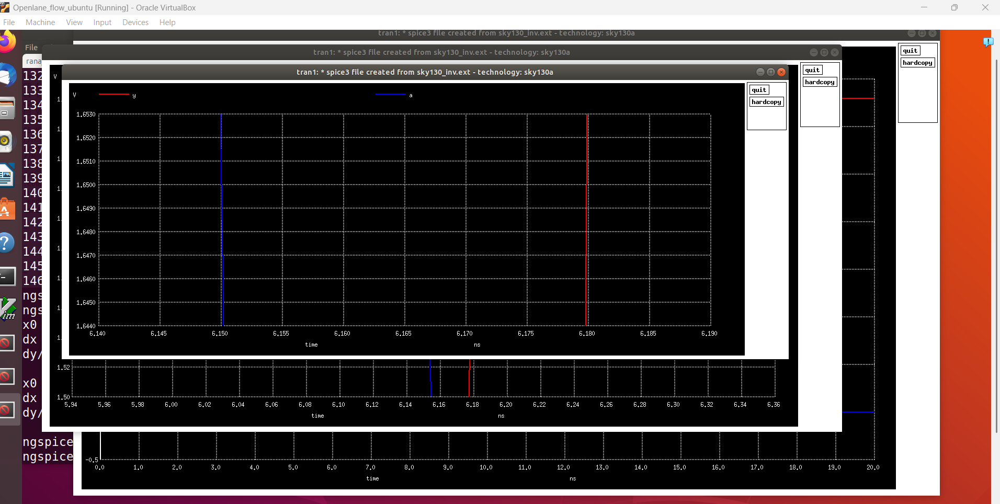
#### Fall time cell delay= output fall to 50 % - input rise to 50% = 8.05325ns - 8.050ns= 0.00325ns
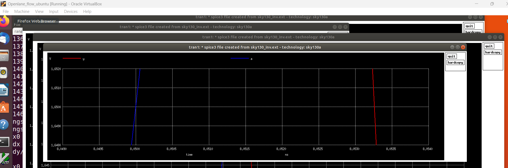

<div align="center">:star::star::star::star::star::star:</div>

## :trophy: Level Status: 

- All objectives completed.
- I have learned about timing paths ,timing graph, setup and hold analysis, slack, critical path, interpretetion of timing report ,variation in real case.
- 🔓 Next level unlocked 🔜 [Level-4: Pre-layout timing analysis and importance of good clock tree](../Level_4/readme.md).
  
<div align="center">:star::star::star::star::star::star:</div> 


